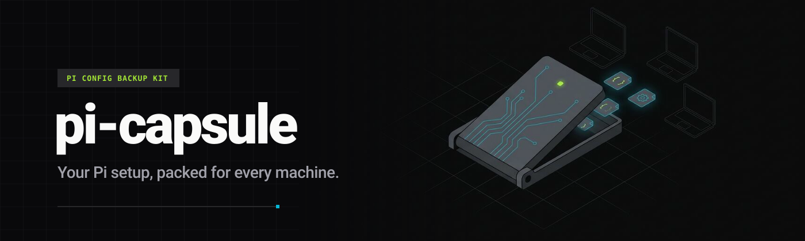

<p align="center">
  
</p>

# pi-capsule

A portable capsule for my [Pi Coding Agent](https://pi.dev) setup. One script snapshots `~/.pi/agent` into this repo; one script unpacks it on a fresh machine. Secrets stay home.

- **Settings** — theme, default provider/model, thinking level, compaction overrides, package list.
- **Providers** — custom `models.json` providers, with literal API keys swapped for `$ENV_VAR` references.
- **Skills & extensions** — everything under `~/.pi/agent/skills` and `~/.pi/agent/extensions`, symlinks dereferenced so the repo is self-contained.
- **Companion CLIs** — `restore.sh` installs each one if missing (official install script) and restores its config from `home/`:
  - [no-mistakes](https://github.com/kunchenguid/no-mistakes) — git push gate · `~/.no-mistakes/config.yaml`
  - [rtk](https://github.com/rtk-ai/rtk) — token-saving CLI proxy, hooked into Pi via `rtk init -g --agent pi` · `~/.config/rtk/*.toml`
  - [treehouse](https://github.com/kunchenguid/treehouse) — reusable worktree pool · `~/.config/treehouse/config.toml`
- **Extension prefs** — `pi-fff.json`, `subscription-usage-prefs.json`, plus `AGENTS.md` / `SYSTEM.md` / `keybindings.json` when present.

## How it works

```text
~/.pi/agent ──export.sh──▶ agent/ ──git push──▶ GitHub
                                                  │
new machine ◀──restore.sh── agent/ ◀──git clone───┘
```

| Step | What happens |
| --- | --- |
| Local packages | `/home/dev/pi-pulse` becomes `git:github.com/zhugez/pi-pulse` (read from the repo's `origin`) |
| API keys | `"apiKey": "sk-…"` becomes `"apiKey": "$MACMINI_CODEX_API_KEY"`; existing `$VAR` / `!command` values are kept |
| Restore | files already in `~/.pi/agent` are moved to `*.bak` before being replaced |
| Companion CLIs | installed only when not on `PATH`; add one by appending `<command> <install-url>` to the `TOOLS` list in `restore.sh` and its config path to `DOTFILES` in `export.sh` |
| First launch | Pi installs any missing `npm:` / `git:` packages from `settings.json` on startup |

## Backup

```bash
./scripts/export.sh
git add -A && git commit -m "sync pi config" && git push
```

## Restore

```bash
git clone https://github.com/zhugez/pi-capsule && cd pi-capsule
./scripts/restore.sh                 # prints every env var it needs
export MACMINI_CODEX_API_KEY=...
pi
```

Then sign in to OAuth providers, and run `no-mistakes init` inside each repo you want gated:

```text
/login antigravity
```

```bash
cd my-repo && no-mistakes init   # adds the gate remote + /no-mistakes skill
git config remote.pushDefault no-mistakes   # plain `git push` now goes through the gate
```

Bypass the gate for one push with `git push origin <branch>`.

Requires `bash`, `jq`, `git` and `curl`. Set `PI_AGENT_DIR` to target a directory other than `~/.pi/agent`.

## Security and privacy

These files are **never** exported:

- `auth.json` — provider OAuth/API credentials
- `antigravity-accounts.json` — linked Google accounts and refresh tokens
- `sessions/`, `run-history.jsonl`, caches, installed packages

`export.sh` rewrites literal keys, but review `git diff` before pushing: `settings.json` and `models.json` still reveal hostnames and model IDs.

## Credits

Banner layout follows [pi-pulse](https://github.com/zhugez/pi-pulse). Illustration generated with Gemini via [`pi-antigravity`](https://github.com/Rahularya01/pi-antigravity).

## License

MIT
